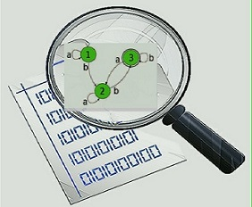

Regular properties are widely used in software analysis and verification. It is challenging to effectively check a regular property of a program. **RGSE** is a regular property guided dynamic symbolic execution (DSE) engine, for finding a Java program path satisfying a regular property as soon as possible. The key idea is to evaluate the candidate branches based on the history and future information, and explore the branches along which the paths are more likely to satisfy the property in priority.

**RGSE** is presented in [[1]](#jump). The technique implemented by **RGSE** was presented in [[2]](#jump). 

* * *

*   [**Installation**](install)

*   [**Tutorial**](tutorials)

*   [**API Documentation**](api)

*   [**Docker Image**](https://1drv.ms/u/s!Amd07GCbYt_zbQZm2w2MBbXI6Zo)

*   [**Manual for the Docker Image**](dockerManual)

*   [**Github Repo**](https://github.com/jrgse/jrgse)

* * *

# **Features**

*   `Good usability`: RGSE can analyze real-world open source Java programs with respect to not only single object but also multiple objects involved regular properties.

*   `Effectiveness and efficiency`: RGSE can effectively find the program paths satisfying a regular property as soon as possible. We applied RGSE to analyze 16 real-world open source Java programs against representative regular properties, compared with DFS mode and pure path slicing mode, RGSE achieves an average 179x and 130x time speedups, respectively.

*   `Extensive applications`: typestate bug finding, path-oriented test case generation, performance tuning, and so on.

* * *

# **Demonstration Video**

<iframe width="560" height="315"
 src="https://www.youtube.com/embed/7zAhvRIdaUU" frameborder="0" allowfullscreen>

 </iframe>

* * *

# **Contacts**

Please feel free to contact us if you have any problem.

*   rgse4java@gmail.com

* * *
[1]. Hengbiao Yu, Zhenbang Chen, Yufeng Zhang, Ji Wang, Wei Dong. RGSE: A Regular Property Guided Symbolic Executor for Java, in 11th Joint Meeting of the European Software Engineering Conference and the ACM SIGSOFT Symposium on the Foundations of Software Engineering (ESEC/FSE 2017), Tool Demo, ACM Press, pp: 954-958. ([PDF](http://zbchen.github.io/Papers_files/fse2017demo.pdf))
[1]. Yufeng Zhang, Zhenbang Chen, Ji Wang, Wei Dong, Zhiming Liu. Regular Property Guided Dynamic Symbolic Execution, in 37th IEEE/ACM International Conference on Software Engineering (ICSE 2015), IEEE Press, pp: 643-653. ([PDF](http://zbchen.github.io/Papers_files/icse2015.pdf))

* * *
