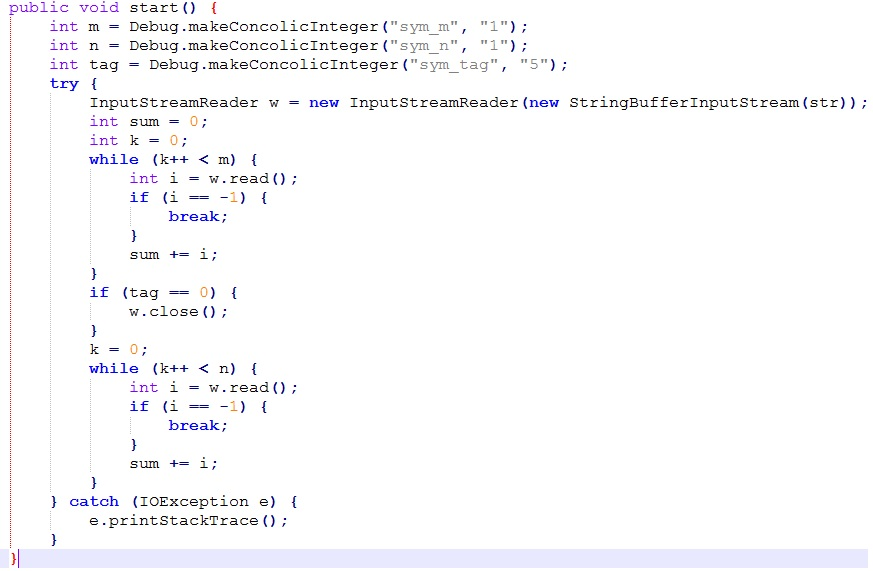
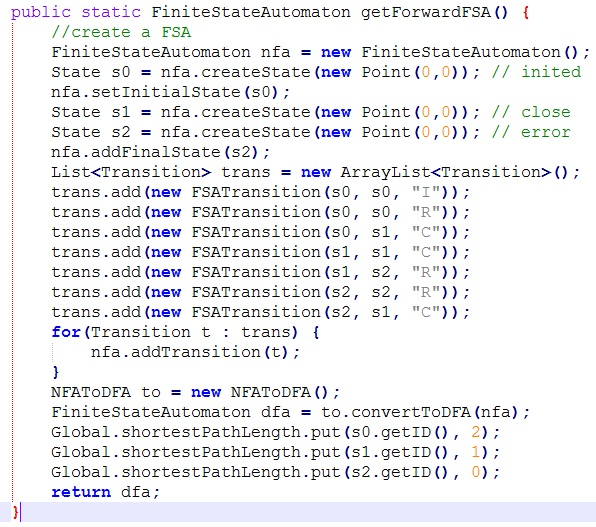
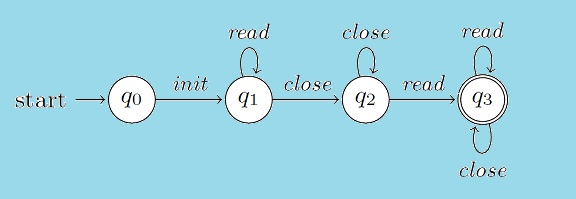
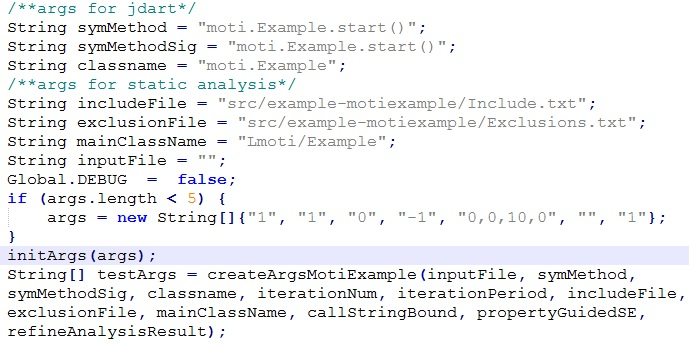
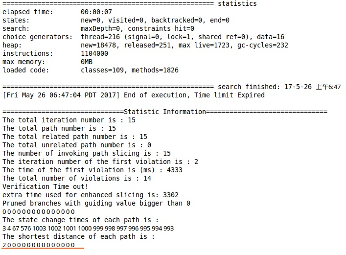
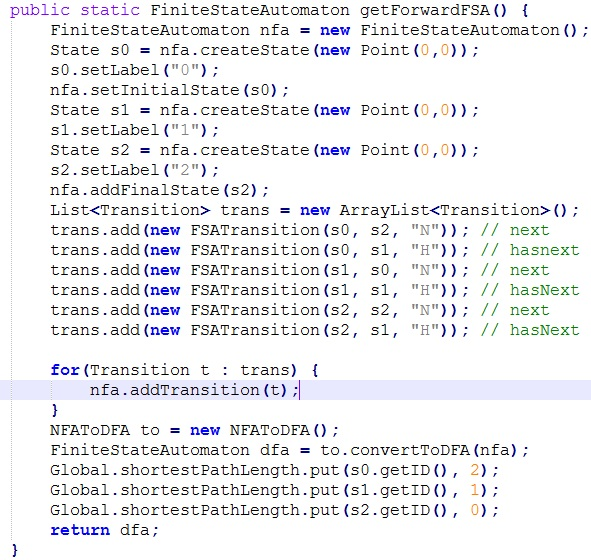
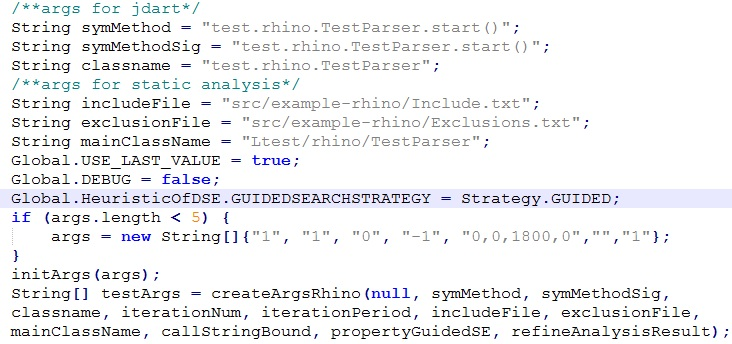
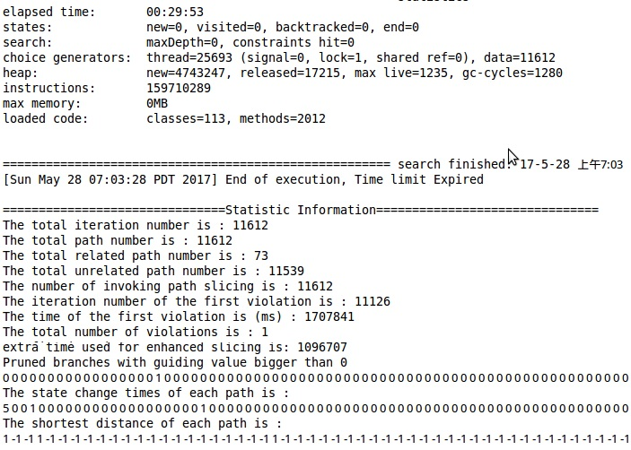

## Tutorials

We provide two tutorials for RGSE. We first apply RGSE to analyze a **motivation** program with respect to the reader property, i.e., the **InputStreamReader** cannot read while closed. Then, we present the analysis of program **Rohino-a** with respect to the Enumeration property, i.e., invoking hasMoreElements before nextElement.

It is worth noting that we introduce how to make a variable symbolic detailedly in the [API documentation](api).

## **A Motivation Example**

The motivation example is shown below. We make the three integer variables **m**, **n**, and **tag** symbolic, and initialize them to 1, 1, and 5, respectively. Obviously, when **tag** equals 0 and **n** is positive, a violation of the reader property exists, i.e., the **InputStreamReader** object **w** reads while it has been closed.

## **(1). Analysis Driver**

The driver gives the entry point of the analysis, and contains two main modules: **property specification** and **running configuration**.

The whole analysis driver for the motivation example can be downloaded from [this link](https://github.com/jrgse/jrgse/blob/master/TestMotiExamplewithSlicing.java).

*   
Property Specification:

We specify the property to be checked as a finite state machine (FSM), where **I**, **R**, and **C** represent the **init**, **read**, and **close** event of the reader property. The property events can be recognized with the help of Java monitors, i.e., comparing the invoked method's name and class type with the property description. **createState** and **new FSATransition** are used to create FSA states and transitions, and details can be found in [API Documentation](api). **Global.shortestPathLength.put(int, int)** is used to record the distance from a state to the accepted state, where the first parameter is the state identifier and the second parameter is the distance.

*   
Running Configuration:

After writing the property specification, we set the running configuration of **RGSE**. Specifically, the five parameters in args represent **call string bound**, **property guided**, **refinement flag**, **iteration threshold**, **time threshold**, **result file name**, and **slicing flag**, respectively. As is shown	below, args (*“1”*, *“1”* *“0”*, *“-1”*, *“0,0,10,0”*, *“”*, *“0”*) sets the **call string bound** to be 1, enables **property guiding**, and sets the **time threshold** to be 10 seconds.

## **(2). Running RGSE**

We can run **RGSE** in two ways, i.e., running the analysis driver as a Java application in Eclipse or running the docker script in command line. The general command for running the script is **“./docker_script arg1 arg2”**. The two paremeters are used to specify the running mode. Specifically, **“0 0”** is for **DFS** mode, **“0 1”** is for **path slicing** mode, and **“1 0”** is for our **guiding** mode.

## **(3). Analysis Result**

The results include the time consumption, explored paths, iteration and time for finding the first accepted path , and so on. For the **motivation** example and the reader property, the results below show that **RGSE** can find the program path satisfying the FSM in the **2nd** iteration. On the other hand, neither **DFS** nor **slicing** can find the property violation within the time threshold.

## **Program Rohino-a**

The Javascript interpreter program **Rohino-a** is from the **Ashes suite** benchmark. The program can be downloaded from [this link](https://github.com/jrgse/jrgse/tree/master/example-rhino).

## **(1). Analysis Driver**

The driver gives the entry point of the analysis, and contains two main modules: **property specification** and **running configuration**.

*   
Property Specification:

We specify the property to be checked as a finite state automaton (FSA), where **H** and **N** represent the **hasMoreElements** and **nextElement** event of the Enumeration property. **createState** and **new FSATransition** are used to create FSA states and transitions, and details can be found in [API Documentation](api.md). **Global.shortestPathLength.put(int, int)** is used to record the distance from a state to the accepted state, where the first parameter is the state identifier and the second parameter is the distance.

*   
Running Configuration:

After writing the property specification, we set the running configuration of **RGSE**. Specifically, the five parameters in args represent **call string bound**, **property guided**, **refinement flag**, **iteration threshold**, **time threshold**, **result file name**, and **slicing flag**, respectively. As is shown below, args (*“1”*, *“1”* *“0”*, *“-1”*, *“0,0,1800,0”*, *“”*, *“0”*) sets the **call string bound** to be 1, enables **property guiding**, and sets the **time threshold** to be 30 minutes.

## **(2). Running RGSE**

We can run **RGSE** in two ways, i.e., running the analysis driver as a Java application in Eclipse or running the docker script in command line. The general command for running the script is **“./docker_script arg1 arg2”**. The two paremeters are used to specify the running mode. Specifically, **“0 0”** is for **DFS** mode, **“0 1”** is for **path slicing** mode, and **“1 0”** is for the **guiding** mode.

## **(3). Analysis Result**

The results include the time consumption, explored paths, the iteration and time for finding the first accepted path, and so on. The results below show that **RGSE** can find the program path satisfying the FSM in **1707X** seconds (about **28 minutes**). On the other hand, neither **DFS** nor **slicing** can find the property violation even within **1 hour**.

